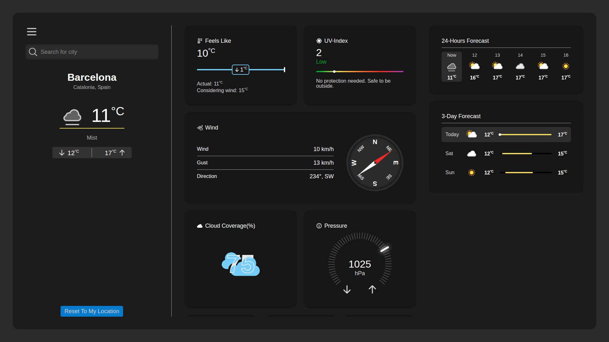

# 🌤️ WeatherApp

A clean and responsive weather application that lets you search for any city and get real-time weather information including temperature, humidity, wind speed, and conditions.

---

## 🔗 Live Demo

👉 [View Live Demo](https://xopsreyli.github.io/weather/)
---

## 📸 Screenshot

---

## ✨ Features

- 🔍 Search weather by city name
- 🌡️ Displays temperature, humidity, and wind speed
- 🌥️ Shows weather condition with descriptive icons
- 🌗 Toggle between **dark and light** theme
- 📏 Switch units of measurement — **Celsius / Fahrenheit** for temperature and **km/h / mph** for wind speed
- 📱 Fully responsive design for mobile and desktop
- ⚡ Fast and lightweight thanks to Vite

---

## 🛠️ Tech Stack

| Technology   | Purpose                        |
|--------------|--------------------------------|
| React        | UI component library           |
| TypeScript   | Type-safe JavaScript           |
| Vite         | Fast build tool & dev server   |

